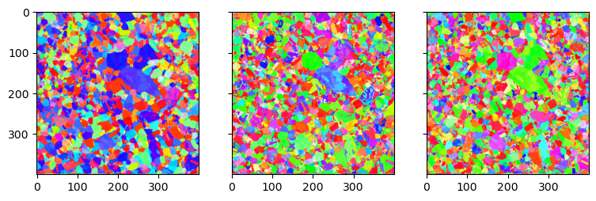
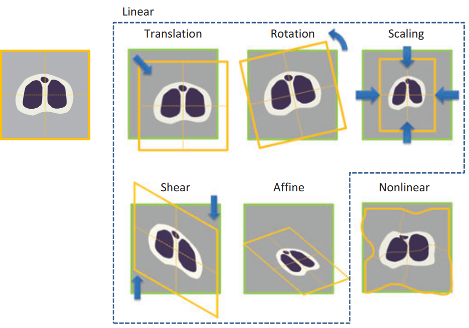
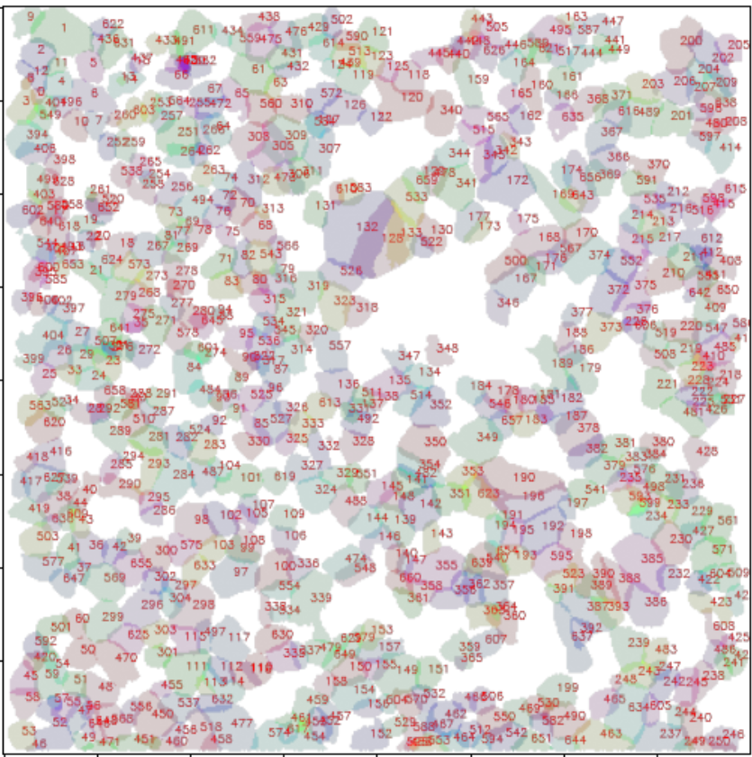
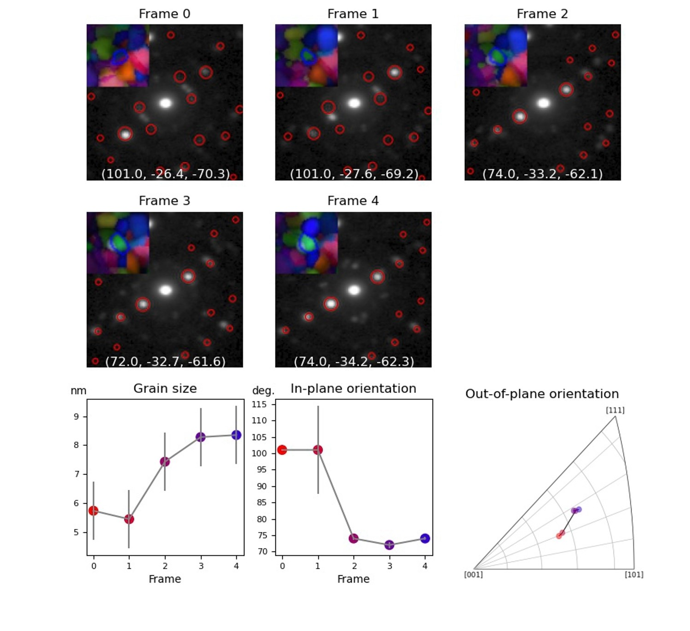
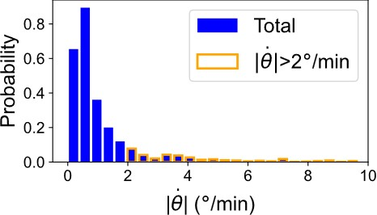

# in situ 4D-STEM Analysis of Polycrystal Grain Evolution

 

  <h3 align="center">an in situ 4d-STEM datasets process and analysis pipeline for crystallography orientation and morphology </h3>
  

     
     
     
  

<!-- TABLE OF CONTENTS -->

  
Table of Contents

  <ol>
    <li>
      <a href="#about-the-project">About The Project</a>
    </li>
    <li><a href="#roadmap">Roadmap</a></li>
    <li><a href="#contact">Contact</a></li>
    <li><a href="#acknowledgments">Acknowledgments</a></li>
  </ol>

<!-- ABOUT THE PROJECT -->
## About The Project

This is the analysis code for in situ 4D-STEM datasets focusing on the evolution of polycrystal grain orientation and morphology. The input is sequential 4d-STEM datasets of the same evolving rigion. Output is the grain-wise morphology and orientation evolution.  
The data analysis is conducted in the following sequence:  
### 1) Diffraction pattern centering (Diff_align.ipynb)  
The 4D-STEM dataset in block file format was imported using the hyperspy package. The diffraction patterns in the 4d-STEM dataset must be well centered. If not, please use this code to center the diffraction patterns. It assumes linear drift of the diffraction pattern. Then the diffraction patterns are shifted and croped, to make sure that the direct beam locates at the center of the image.  
### 2) Generate diffraction simulation library (Simu_generate.ipynb)  
For grain orientation indexation, we need to generate diffraction pattern library for the following matching. The diffraction pattern library was generated with an angle interval of 1˚. The simulated library was used to index the experimental NBED patterns via the pyxem package. The indexing confidence was defined as the value of the normalized cross-correlation of the diffraction template with the NBED pattern.  
This code is adapted from: Cautaerts, Niels, et al. Ultramicroscopy 237 (2022): 113517.  
### 3) Orientation indexation (Index_by_Pixel.ipynb)  
Orientation indexing involved the following steps: generating a simulated diffraction pattern library for Pt using the diffsims package, matching each experimental nanobeam electron diffraction (NBED) pattern with simulation patterns in the library using cross-correlation, and selecting the best match result as the indexed orientation for each pixel with its corresponding NBED pattern.  
Following image shows the indexed orientation mapping.  
  
### 4) Scan distortion correction (Distortion_corr.ipynb)  
Since the data was collected during in situ experiment, the drift of the sample leads to scan distortion of the 4d-STEM dataset. There are several type of models to describe the distortion/drift of the datasets, respectively rigid, affine, perspective and non-linear, as shown in the following image (from Uchida S. Image processing and recognition for biological images. Development, growth & differentiation, 2013, 55(4): 523-549.).  
  
When the sample drift is uniform, affine transformations can be applied to correct drift and distortion. We firstly try the affine transformation. Virtual dark field (VDF) images of the dataset are obtained, and features in the VDF images are detected using a scale-invariant feature transform (SIFT) detector from the openCV package. Feature points in different images are matched to obtain affine transformation matrices for drift and distortion correction. The affine transformations are then applied to align all 4D-STEM datasets.  
Then we also try the non-linear model for correcting the distortion, since when the sample drift is complicated, the 4d-stem dataset distortion would only be described by non-linear model. It turns out that the non-linear model works better. We take the non-linear model to correct the distortion in our dataset. Inverse pole figures of the dataset are obtained from step #3, and the registration matrix was learnt from the elastic registration tool called bUnwarpJ (Arganda-Carreras I, Sorzano C O S, Marabini R, et al. Consistent and elastic registration of histological sections using vector-spline regularization//Computer Vision Approaches to Medical Image Analysis: Second International ECCV Workshop, CVAMIA 2006). We take frame 5 as the reference and register all other images to it. The elastic transformations are then applied to align all 4D-STEM datasets.  
### 5) Non-negative matrix factorization (NMF) grain segmentation (NMF_Grain_Seg.ipynb)  
Grain segmentation was conducted using non-negative matrix factorization (NMF). Unlike traditional methods such as hierarchical clustering or minimum spanning tree, NMF does not require prior knowledge of local orientation. This is advantageous because traditional methods can propagate errors caused by mis-indexed local orientations, which often occur due to limited data quality. NMF automatically identifies and clusters similar NBED patterns, avoiding these error propagation issues. NMF has been shown to work well on 4D-STEM datasets for grain segmentation. Another advantage of NMF is its ability to determine grain locations and areas regardless of grain overlapping. In the case of nanocrystalline films, where initial grain size is smaller than the film thickness and grains overlap near grain boundaries (GBs), traditional methods that assign pixels to only one grain are not suitable. Therefore, NMF is applied for grain segmentation.  
One disadvantage of NMF for grain segmentation is its longer computational time. The complexity of NMF is (nm)^O(2*pi*r2), where n is the number of factors, m is the number of loadings, and r is the amount of data for segmentation. For the 4D-STEM dataset with 400x400 pixels and thousands of grains, the NMF segmentation time is too long and difficult to estimate. To decrease the complexity, the dataset is divided into 25 smaller 80x80 datasets, and NMF is performed on each split dataset. Grains near the dividing lines are removed, and the segmented grains from each small dataset are recombined. The process is repeated by shifting the dividing lines to recover the grains near the cutting lines. Duplicated grains are identified by cross-correlation of loading and factor matrices with those of other grains. Grain locations are determined by thresholding the loading map of each grain. After these processes, most grains are recognized in the 4D-STEM dataset.  
Following image shows all the grains recognized:  
  
### 6) Grain association (Grain_Asso.ipynb and Grain_Chain_Analysis.ipynb)  
The same grains in different frames are linked as a chain, with grains having the closest center of mass determined as the same grain. To account for grain disappearance during in situ experiments, all grains in the last frame of the dataset are registered first, and then the tracking is performed frame by frame. Grain chain objects are created to store information about the grains in different frames. Supplementary Fig. 2 illustrates the stored information, including grain morphology and orientations. It should be noted that grain orientation is reindexed based on the averaged diffraction patterns of the same grains during this process.  
Following image shows the evolution of a grain as an example.  
  
### 7) Statistics and visualization (Visual.ipynb)  
With the information of each grain at each time frame, statistical analysis is conducted to examine the changes in grain size and orientation. By comparing the relevant quantities at different frames, the change in grain size and orientation for each grain is determined. Since these properties are stored together for each grain, the correlation between them is established by thresholding the misorientation values. After extracting the relevant information, the data is visualized in histogram form.  
As shown in the following image, the distribution of grain rotation velocity can be extracted.  
  

<!-- ROADMAP -->
## Roadmap

- [x] Orientation mapping
- [x] Grain segmentation
- [x] Grain association
- [x] Grain-wise spatial temporal analysis
- [ ] In situ strain analysis

(<a href="#readme-top">back to top</a>)

<!-- CONTACT -->
## Contact

Yuan Tian - tiany17@uci.com

(<a href="#readme-top">back to top</a>)

<!-- ACKNOWLEDGMENTS -->
## Acknowledgments

This project is supported by Army Research Office (ARO) Project about grain boundary dynamics. The code was developed for the analysis of in situ 4d-STEM datasets of grain rotation and grain boundary dynamics in polycrystal materials. The data was collected at Irvine Materials Research Institute (IMRI), UCI.  
A key reference for this work is Cautaerts, Niels, et al. Ultramicroscopy 237 (2022): 113517.  

(<a href="#readme-top">back to top</a>)

